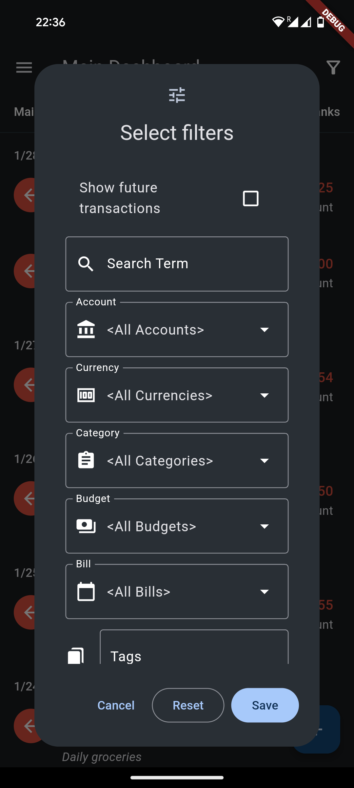
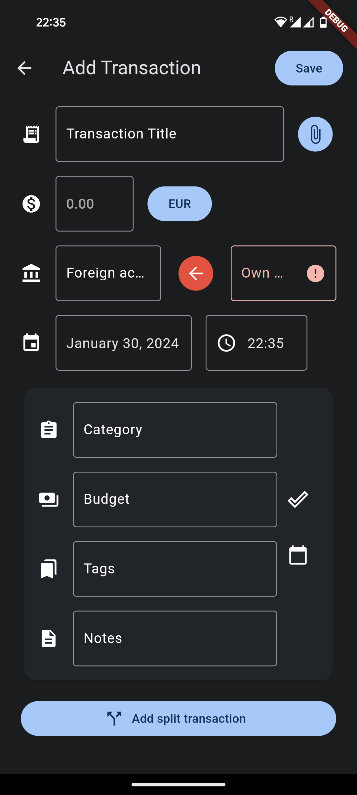
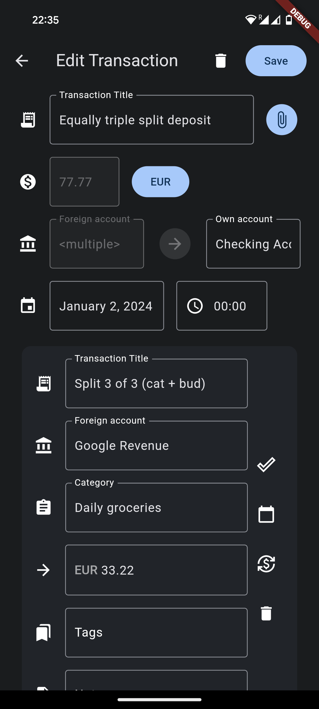
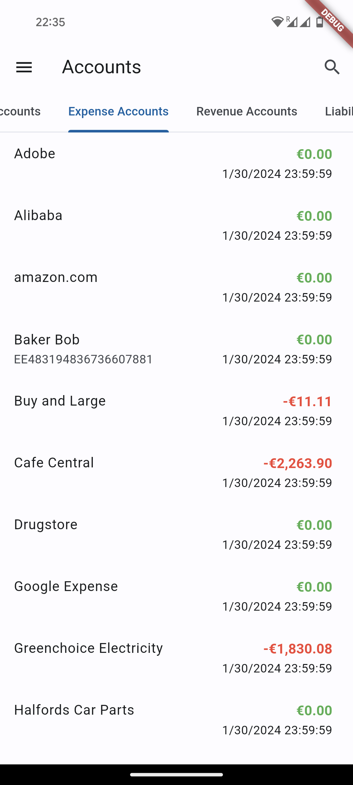
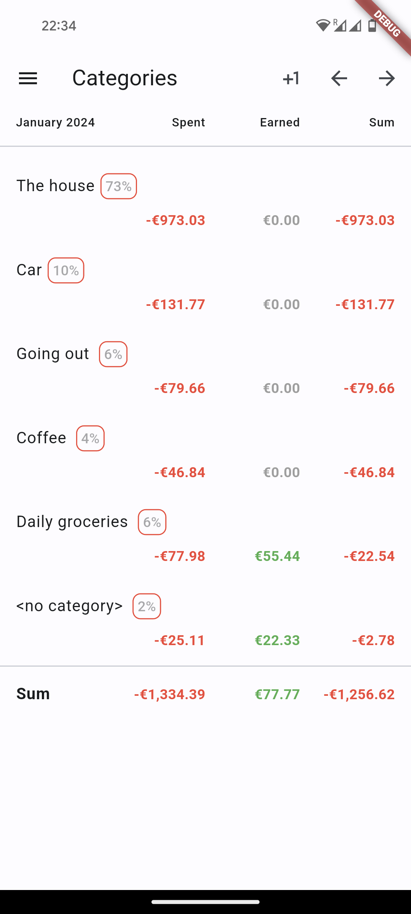
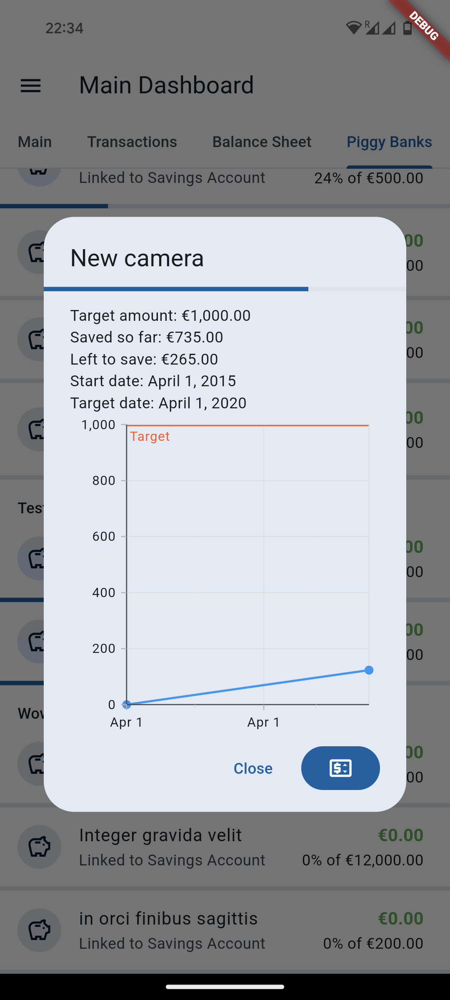

# Waterfly III

  
  

**Unofficial** Android App for [Firefly III](https://github.com/firefly-iii/firefly-iii), a free and open source personal finance manager.

The app design is heavily influenced
by [Bluecoins](https://play.google.com/store/apps/details?id=com.rammigsoftware.bluecoins). Please
also read the [FAQ](https://github.com/dreautall/waterfly-iii/blob/master/FAQ.md).

## Features

- General
  - Light & Dark mode, supports dynamic colors
  - Translation ready - [**help to translate via Crowdin**](https://crowdin.com/project/waterfly-iii)!
  - Listen to incoming notifications (e.g., from Google Pay or your banking app) and pre-fill transactions
  - Option to require fingerprint to open the app
- Dashboard
  - Five different charts charts for the current balance & recent history
  - Waterfall chart for net earnings in recent months
  - Budget overview for last 30 days
  - Upcoming bills
- Transactions
  - List transactions by date
  - Ability to filter the list by various fields
  - Add & edit transactions with autocomplete, including attachments and pictures, split transactions & multi currency support
- Balance Sheet
  - List individual account balances
- Piggy Banks
  - View piggy banks, sorted by category
  - Add/Remove money from piggy banks
- Accounts
  - List all asset/expense/revenue/liability accounts
  - Search for specific accounts
- Categories
  - View monthly transactions split up by category
  - Add, edit & delete categories
- Bills
  - View bills and their overview organized into groups
  - Inspect bill details and see connected transactions

### Feature Status

The app does **not** try to replicate every single feature that the Webinterface has. Instead, it tries to be a good *companion* to access the most used functions on-the-go. More in-depth operations such as creating or modifying rules are not planned for this app.

If you are missing anything, feel free to open a [feature request](https://github.com/dreautall/waterfly-iii/issues/new/choose), or look at what other users [are requesting](https://github.com/dreautall/waterfly-iii/issues?q=is%3Aissue+is%3Aopen+label%3Aenhancement).

## Releases

The stable releases are published to the [Google Play Store](https://play.google.com/store/apps/details?id=com.dreautall.waterflyiii), and are also available for download from the [GitHub releases page](https://github.com/dreautall/waterfly-iii/releases/latest). There is no fixed release schedule.

You can also opt in to the (open) beta channel at Google Play [here](https://play.google.com/apps/testing/com.dreautall.waterflyiii). The beta channel will feature the "pre-releases" from the [GitHub releases page](https://github.com/dreautall/waterfly-iii/releases), and might not be as stable.

## Screenshots

*All made with a Google Pixel 8, showing Waterfly III v1.0.0*

|Dashboard|Transactions|Transaction Filters|
| :-: | :-: | :-: |
|  |  |  |

Transaction Add|Transaction Edit|Transaction Attachments|
| :-: | :-: | :-: |
|  |  |  |

Account Screen|Category Screen|Piggy Banks with Chart|
| :-: | :-: | :-: |
|  |  |  |

## Technology

The app is built using [Flutter](https://flutter.dev/), and tries to keep to the [Material 3](https://m3.material.io/) design guidelines. Additionally, I try to keep the app as "lean" as possible, **without any trackers** or unneeded dependency on external packages.

## Motivation

Having troubles with [Bluecoins](https://play.google.com/store/apps/details?id=com.rammigsoftware.bluecoins) syncing across devices and not always storing attachments online, I was looking for a self-hosted alternative and discovered [Firefly III](https://www.firefly-iii.org/). After a [quick script to migrate from Bluecoins to Firefly III](https://github.com/dreautall/bluecoins-to-fireflyiii), the only thing left was to download an app to easily track expenses on-the-go… or so I thought.

Unfortunately, I discovered that the existing Android Apps for Firefly III had been either outdated or very buggy and hardly maintained. Always wanting to use Flutter for something, I started to make my own app, modeling it after the Bluecoins app I used so far and its interface that I really liked.