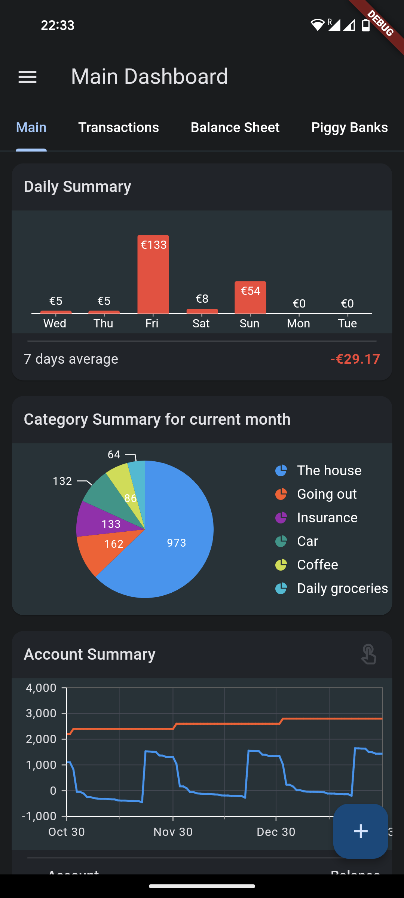

# Waterfly III

**Unofficial** Android App for [Firefly III](https://github.com/firefly-iii/firefly-iii), a free and open source personal finance manager.

The app design is heavily influenced by [Bluecoins](https://play.google.com/store/apps/details?id=com.rammigsoftware.bluecoins).

## Features

The app is still pretty much work in progress, but basic features already do work:

- Dashboard
  - Multiple charts for the current balance & recent history
  - Budget overview for last 30 days.
- Transactions
  - List transactions by date, including (basic) filters.
  - Add & edit transactions with autocomplete, including attachments, split transactions & multi currency support
- Balance Sheet
  - List invididual balances

### Planned Features
- Piggy Banks
- Dark Mode
- Detailed Accounts page
- Settings page
- Notification Listener
- ... and many more.

## Screenshots

*All made with a Google Pixel 5.*

Dashboard | Transactions | Balance Sheet |
| :-: | :-: | :-: |
||

Transaction Edit | Split Transaction | Transaction Attachments
| :-: | :-: | :-: |
||

## Technology

The app is built using [flutter](https://flutter.dev/), and tries to keep to the [Material 3](https://m3.material.io/) design guidelines. Additionally, I try to keep the app as "lean" as possible, without external trackers or unneeded dependency on external packages.

## Motivation

Having troubles with [Bluecoins](https://play.google.com/store/apps/details?id=com.rammigsoftware.bluecoins) syncing across devices and not always storing attachments online, I was looking for a self-hosted alternative and discovered [Firefly III](https://www.firefly-iii.org/) (see also my [conversion script](https://github.com/dreautall/bluecoins-to-fireflyiii)).

Unfortunately, the existing Android Apps for Firefly III are either outdated or very buggy and hardly maintained. Always wanting to use Flutter for something, I started to make my own app, modeling it after the Bluecoins app I used so far and whose interface I really liked.